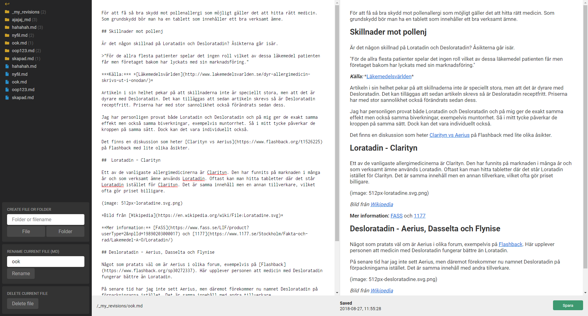

# Cursor

A PHP markdown editor with live split screen preview. Drop on your domain/server and you can start edit the files right away.



## Options

You need to create `options.php` and place it in the root.

```php
return [
  'autosave' => true,
  'autosave.interval' => 15,
  'bar.bottom' => true,
  'bar.top' => true,
  'editor.width' => 900,
  'filetypes.image', ['png', 'gif', 'svg', 'webp', 'jpg', 'jpeg'],
  'filetypes.markdown', ['markdown', 'mdown', 'mkdn', 'md', 'mkd', 'mdwn', 'mdtxt', 'mdtext', 'text', 'rmd', 'txt', ''],
  'project.css' => null,
  'project.path' => null,
  'preview.width' => 900,
  'revisions.folder' => 'revisions',
  'revisions.hide' => true,
  'revisions.max' => 2,
  'root.url' => null,
  'sidebar.width' => 300,
  'spellcheck' => false,
];
```

| Name               | Type     | Default     | Description |
| ------------------ | -------- | ----------- | ----------- |
| autosave           | bool     | true        | Save the file automatically after a numer of seconds |
| autosave.interval  | int      | 15          | If autosave is true, you can use this option to set number of seconds |
| bar.bottom         | bool     | true        | Enable or disable the bottom bar |
| bar.top            | bool     | true        | Enable or disable the top bar |
| editor.width       | int      | 900         | Set the editor textarea width |
| filetypes.image    | array    | See above   | The most common image filetypes are listed in the file tree |
| filetypes.markdown | array    | See above   | The most common markdown filetypes are listed in the file tree |
| project.css        | string   | null        | Set a custom css for the preview to match your project |
| project.path       | string   | null        | You need to set the path to your project folder where your markdown files are stored |
| preview.width      | int      | 900         | Set the preview width to match your project |
| revisions.folder   | string   | 'revisions' | If `revisions.max` is set, you can specify a name for the revisions folder |
| revisions.hide     | bool     | true        | If you don't want to show the revisions folder in the filetree, you can hide it |
| revisions.max      | bool/int | 2           | To use revisions, set the number of revisions you want to keep. To disable it, set it to `false` |
| root.url           | string   | null        | The root url from where to acess Markia |
| sidebar.width      | int      | 300         | Set the sidebar width in case your file structure gets too wide |
| spellcheck         | bool     | false       | Spellchecker is `false` by default but you can enable it if needed |

## Libries used

- [Codemirror](https://github.com/codemirror/CodeMirror) - Brings syntax hightlighting to the textarea.
- [Knock](https://github.com/jenstornell/knock) - The authorization library for logging in.
- [Remixicon](https://remixicon.com/) - A special thanks to [xiaochunjimmy](https://github.com/xiaochunjimmy) for not only providing a beautiful icon pack with 24px icons, but also for making custom designed 18px icons for this project.
- [staircase.js](https://github.com/jenstornell/staircase.js) - Used for the filetree in the sidebar.
- [Marked](https://github.com/markedjs/marked) - The markdown parser that transforms markdown to html.
- [Message](https://github.com/jenstornell/message.js) - A library to trigger messages from ajax.
- [TinyOptions](https://github.com/jenstornell/TinyOptions) - A library to make PHP options much simpler.
- [TinyRoutes](https://github.com/jenstornell/TinyRouter) - A router to make better urls.
- [Wall](https://github.com/jenstornell/wall) - The login screen.

## Revisions

A revision is a copy of the file you just saved. If something goes wrong, you may have revisions saved and does not need to redo so much work.

By default the file `hello.md` will be saved and copied as a revision to `revisions/hello.md/1550144390`.

- You can change `revisions` to another folder name if you want.
- `hello.md` folder will be created. Inside it all the revisions of that file will be created.
- `1550144390` is the timestamp of the current time. It's used as a unique id. The highest number, the newer revision.
- On `delete` the whole revisions folder will be deleted as well. That way, no garbage will be kept.
- On `rename` the `hello.md` (in this case) folder will be renamed to always match the filename.

## License

### During minefield, alpha, beta and rc

Before it's relased it will be free. Hopefully all the bugs can be fixed before the release.

### When released

- Try first, buy later.
- A license will cost around 25 USD / EUR.
- You will own the license for life.
- The license cannot be resold because it's personal.
- Support will not be included, but you can add issues in case of trouble.