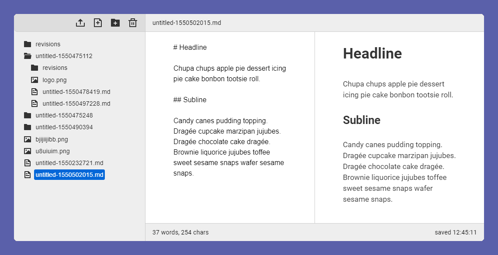

# Markia

A really simple PHP Markdown self hosted editor for editing your files directly on your server.

Just drop this tool on your server and set your path in the `config.php` and you are ready to  write.

- Live markdown preview, based on [Marked](https://github.com/markedjs/marked)
- Split screen supports syncronized scroll, based on [syncscroll](https://github.com/asvd/syncscroll)
- Icons by [Ionicons](https://ionicons.com/)

***So far this is a concept. I have a working version on my computer. If there is a big interest of this, I will release it to a public***

Tell me in the issues what you think and ideas you have. Also I'm interested in if there are already tools that does the same thing.

