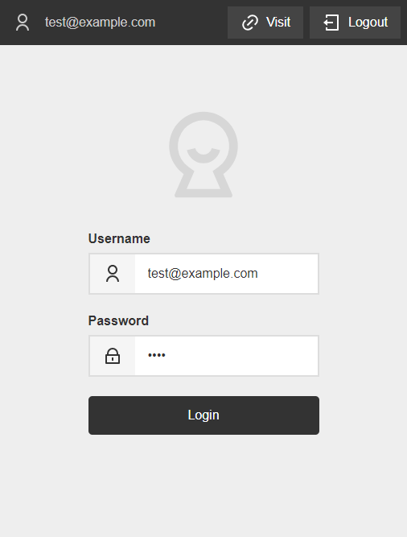

# Wall

A simple PHP login form with authorization.

*Version 1.0* - [Changelog](changelog.md)



## Usage

### Create a user

The folder structure may look like below where filename should be `[username].php`.

```text
└─ users
   └─ test@example.com.php
```

#### Inside the user file

Inside the user file you return the password. To use the password `test` you need to hash it with a tool like [SHA256 Hash Generator](https://passwordsgenerator.net/sha256-hash-generator/).

```php
<?php return '9f86d081884c7d659a2feaa0c55ad015a3bf4f1b2b0b822cd15d6c15b0f00a08';
```

*You can also use `<?php return hash('sha256', 'test');`, but it's not recommended. Use it for testing purpose only!*

## Options

Most options are inherited from [Knock](https://github.com/jenstornell/knock#user-content-options-optional) so you can use them if needed.

### Defaults

```php
<?php
return [
  'redirect.url' => wall::url(),
  'text.login' => 'Login',
  'text.login.error' => 'Something went wrong. Try again!',
  'text.login.success' => 'You are logged in as',
  'text.login.unauthorized' => 'Username or password was wrong. Try again!',
  'text.logout' => 'Logout',
  'text.password' => 'Password',
  'text.visit' => 'Visit',
  'text.username' => 'Username',
];
```

You can see the additional options below.

| Name                      | Type   | Default                                       | Description                                                             |
| ------------------------- | ------ | --------------------------------------------- | ----------------------------------------------------------------------- |
| `redirect.url`            | string | null                                          | The url that the login form should redirect to after a successful login |
| `text.login`              | string | `'Login'`                                     | The login button text                                                   |
| `text.login.error`        | string | `'Something went wrong. Try again!'`          | The message if something goes wrong on login                            |
| `text.login.success`      | string | `'You are logged in as'`                      | The message if logged in successfully                                   |
| `text.login.unauthorized` | string | `'Username or password was wrong. Try again'` | The message if username or password is wrong                            |
| `text.logout`             | string | `'Logout'`                                    | The logout button text                                                  |
| `text.password`           | string | `'Password'`                                  | The password label in the form                                          |
| `text.visit`              | string | `'Visit'`                                     | The visit button text. The visit button goes to the redirected url      |
| `text.username`           | string | `'Username'`                                  | The username label in the form                                          |

## Libraries used

- [Knock](https://github.com/jenstornell/knock)
- [Remixicon](https://remixicon.com/)
- [TinyOptions](https://github.com/jenstornell/TinyOptions)

## Requirements

- PHP 7+

## Disclaimer

This plugin is provided "as is" with no guarantee. Use it at your own risk and always test it yourself before using it in a production environment. If you find any issues, please [create a new issue](issues/new).

## Donate

Donate to [DevoneraAB](https://www.paypal.me/DevoneraAB) if you want.

## License

MIT